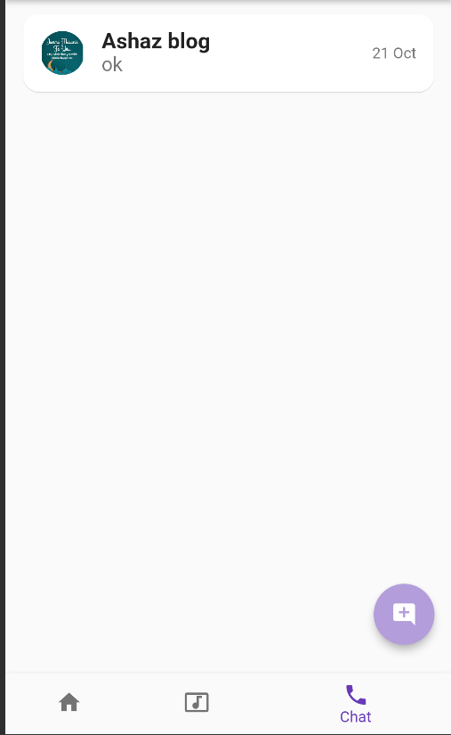

# STRNGER

A flutter application that promotes mental well-being and private communication between the public.

## sections
it is divided into three main sections including home, relax and chat section

